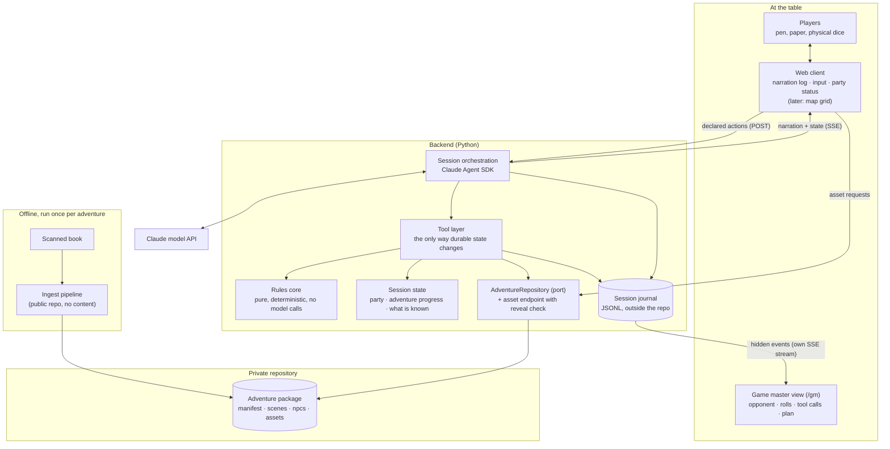

# Architecture

> This document is derived from the accepted decision records in
> `docs/adr/`. It is updated in the same commit that accepts an ADR.
> If the two disagree, the ADRs are authoritative.

## Shape

A web application with a Python backend, in which the dungeon master is an
agent with explicit tools ([ADR-0002](adr/0002-application-form-factor.md)).
The players sit at one table and share one client view. Adventure content is
private, lives in its own repository, and is loaded at runtime through a
port rather than a path ([ADR-0003](adr/0003-adventure-content-separation.md)).
At the table the whole thing is one process: `uvicorn` serves the API and the
built client together ([ADR-0005](adr/0005-concrete-web-stack.md)). Everything
outside the fiction is kept in a session journal and shown in a separate game
master view, never on the table's screen
([ADR-0006](adr/0006-game-master-view-and-session-journal.md)).

## Components

**Web client.** The shared surface at the table. React with Vite and
TypeScript ([ADR-0005](adr/0005-concrete-web-stack.md)). In the first iteration
it renders narration and takes input; the party status panel follows early, the
map grid later. It renders only what the backend sends it, which is how hidden
information stays hidden. It receives state, never markup, which is what keeps
it replaceable — by a client on a tablet, or eventually a native one — without
the backend changing.

**Transport.** Server-Sent Events carry everything the table sees: narration
arrives as `narration_delta`, durable state as `party_updated` and its
siblings. The status panel renders from the state events and from nothing else,
so a number on the panel always came through a tool. A declared action and the
dice the player rolled go back as an ordinary `POST`. Event ids and the
browser's own `Last-Event-ID` carry a session across a dropped connection.
See [ADR-0005](adr/0005-concrete-web-stack.md).

**Session orchestration.** Runs the dungeon master agent via the Claude Agent
SDK: builds its context, streams narration to the client, and exposes the
tool surface. This is the only component that depends on the Agent SDK. The
HTTP surface around it is FastAPI, confined to a thin API layer: neither the
rules core nor session state imports a web framework or the SDK, and CI fails a
build that breaks that boundary ([ADR-0005](adr/0005-concrete-web-stack.md)).

**Session journal.** An append-only JSON Lines file per session, at a configured
path outside the repository: every tool call with its arguments and result,
every roll the code makes with its dice, every state event, every update of the
agent's plan, and per model turn the usage, cost and credential mode. The tool
layer and orchestration write it; it contains adventure text and is kept like
the adventure package. It is a record, not persistence
([ADR-0006](adr/0006-game-master-view-and-session-journal.md)).

**Game master view.** A separate route, `/gm`, in the same client, fed by its
own SSE stream and rendered from the journal: opponent state, roll records, tool
calls, the agent's plan, cost per turn, and from iteration 002 undiscovered
adventure information. The table's stream carries a closed list of event types,
enforced by a test, so nothing hidden reaches the shared screen by a rendering
mistake. The agent's plan is written through a tool, never extracted from its
reasoning. The SDK's OpenTelemetry export is an optional second layer, pointed
at a local collector only
([ADR-0006](adr/0006-game-master-view-and-session-journal.md)).

**Tool layer.** The contract between the agent and everything durable. The
agent narrates and decides; it does not mutate state by describing a
mutation. Tool contracts are designed from the domain, so a tool can start
out backed by model judgement and later be backed by deterministic code
without anything above it changing.

**Rules core.** Ordinary Python domain logic — dice arithmetic, attack
resolution, conditions, state transitions. It imports neither the Agent SDK
nor any model client, and is tested deterministically. It grows over
iterations as responsibility moves out of the model
([ADR-0002](adr/0002-application-form-factor.md), commitment 2).

**Session state.** What must survive a restart: party state, adventure
progress, what the players have learned. Narrative texture that need not
survive stays in the model's context and is deliberately not modelled here.

**Party state.** Of each character the system holds only what it computes
*against* ([ADR-0004](adr/0004-character-state-ownership.md)): name, class and
level for narration, armour class, maximum, current and temporary hit points,
active conditions, and later position on the map. Everything else — ability
scores and modifiers, skills, attacks, spells, limited resources, inventory —
stays on the players' paper sheets, because the players roll and add
themselves and the system never needs those values to adjudicate what they
do. The line is drawn by how often the system needs a value and how quickly a
player could answer it; moving it requires a new decision record. Characters
are typed in once per campaign, and the status panel shows exact hit points.

**AdventureRepository.** A port, not a path. The engine asks for a scene, an
NPC or an asset by identity; the filesystem implementation resolves that
against an adventure package directory whose location comes from
configuration. Tests use an in-memory implementation with original or SRD
content, so the engine is fully testable with no private content present.

Assets never reach the client as static files. They are served by an
endpoint that checks the current reveal state first, so a map the party has
not found cannot be fetched by guessing a URL.

**Ingest pipeline.** A separate offline tool in this repository. It turns a
prepared source into an adventure package that validates against the
schemas in `schemas/adventure/`. It contains no adventure material, and its
test fixtures must be original or SRD content.

## Decisions

| Decision | ADR | Status |
| --- | --- | --- |
| Record architecture decisions | [ADR-0001](adr/0001-record-architecture-decisions.md) | accepted |
| Application form factor | [ADR-0002](adr/0002-application-form-factor.md) | accepted |
| Adventure content separation | [ADR-0003](adr/0003-adventure-content-separation.md) | accepted |
| Character state ownership | [ADR-0004](adr/0004-character-state-ownership.md) | accepted |
| Concrete web stack | [ADR-0005](adr/0005-concrete-web-stack.md) | accepted |
| Game master view and session journal | [ADR-0006](adr/0006-game-master-view-and-session-journal.md) | accepted |

## Open

- The v1 adventure schema is iteration work, not yet defined.
- The initial tool surface of the dungeon master agent is defined as part of
  iteration 1 planning. It is the same piece of work as the event contract,
  because every tool that changes durable state produces an event
  ([ADR-0005](adr/0005-concrete-web-stack.md)).
- How a player interrupts a turn while narration is still being generated. The
  transport cannot carry it today, deliberately
  ([ADR-0005](adr/0005-concrete-web-stack.md)).
- Whether limited resources — spell slots, rage uses, hit dice — ever cross
  into the state the system owns. They are outside it today
  ([ADR-0004](adr/0004-character-state-ownership.md)).
- Whether a session is restored by replaying its journal
  ([ADR-0006](adr/0006-game-master-view-and-session-journal.md)).
