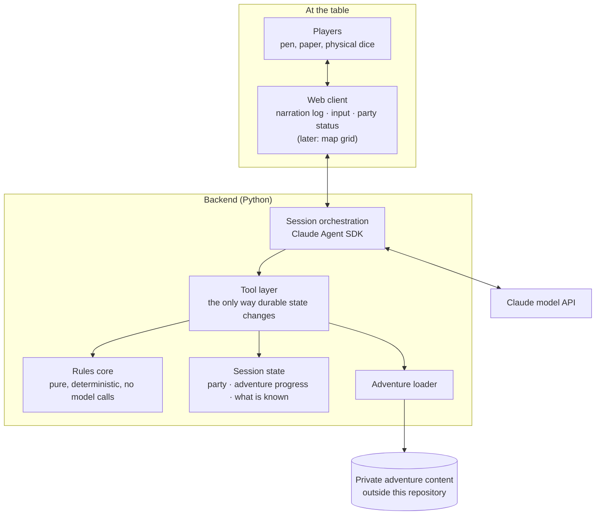

# Architecture

> This document is derived from the accepted decision records in
> `docs/adr/`. It is updated in the same commit that accepts an ADR.
> If the two disagree, the ADRs are authoritative.

## Shape

A web application with a Python backend, in which the dungeon master is an
agent with explicit tools ([ADR-0002](adr/0002-application-form-factor.md)).
The players sit at one table and share one client view. Adventure content is
private and loaded at runtime from outside this repository
([ADR-0003](adr/0003-adventure-content-separation.md), proposed).

## Components

**Web client.** The shared surface at the table. In the first iteration it
renders narration and takes input; the party status panel follows early, the
map grid later. It renders only what the backend sends it, which is how
hidden information stays hidden.

**Session orchestration.** Runs the dungeon master agent via the Claude Agent
SDK: builds its context, streams narration to the client, and exposes the
tool surface. This is the only component that depends on the Agent SDK.

**Tool layer.** The contract between the agent and everything durable. The
agent narrates and decides; it does not mutate state by describing a
mutation. Tool contracts are designed from the domain, so a tool can start
out backed by model judgement and later be backed by deterministic code
without anything above it changing.

**Rules core.** Ordinary Python domain logic — dice arithmetic, attack
resolution, conditions, state transitions. It imports neither the Agent SDK
nor any model client, and is tested deterministically. It grows over
iterations as responsibility moves out of the model
([ADR-0002](adr/0002-application-form-factor.md), commitment 2).

**Session state.** What must survive a restart: party state, adventure
progress, what the players have learned. Narrative texture that need not
survive stays in the model's context and is deliberately not modelled here.

**Adventure loader.** Reads structured adventure files from a location
outside this repository and exposes them to the tool layer.

## Decisions

| Decision | ADR | Status |
| --- | --- | --- |
| Record architecture decisions | [ADR-0001](adr/0001-record-architecture-decisions.md) | accepted |
| Application form factor | [ADR-0002](adr/0002-application-form-factor.md) | accepted |
| Adventure content separation | [ADR-0003](adr/0003-adventure-content-separation.md) | proposed |
| Character state ownership | [ADR-0004](adr/0004-character-state-ownership.md) | proposed |
| Concrete web stack | ADR-0005 | not yet written |

## Open

- The concrete web stack — HTTP framework, client framework, transport for
  streaming narration — is deferred until iteration 1 is scoped.
- The initial tool surface of the dungeon master agent is defined as part of
  iteration 1 planning.
