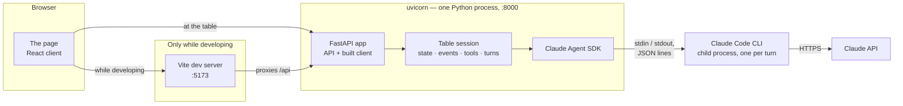
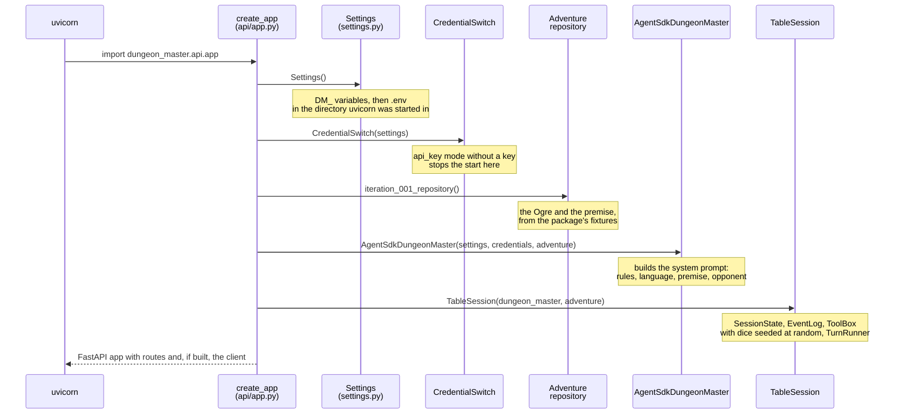
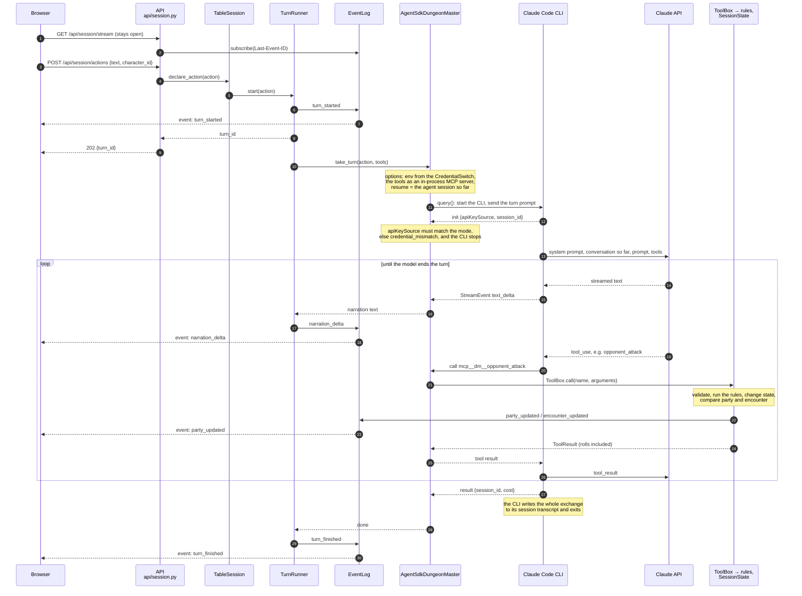

# What happens when it runs

How the pieces of [the architecture](architecture.md) talk to each other at run
time: which processes there are, what starting the backend builds, what one
declared action sets in motion, and where to look when something goes wrong.

This document follows the code, not the decision records. When the code
changes, this changes with it, in the same pull request.

## The processes



- **At the table** there is one process: `uvicorn` serves the API and the
  built client from `client/dist`. The browser talks only to it.
- **While developing** there are two: `uvicorn` for the API, and the Vite dev
  server, which serves the client from its source with hot reload and passes
  every `/api` request through to `uvicorn`.
- **For every declared action** the Agent SDK starts the Claude Code CLI as a
  child process, which talks to the Claude API and ends with the turn. The
  CLI is bundled with the `claude-agent-sdk` package; nothing has to be
  installed for it.

Everything the session holds — the party, the encounter, the opponent, the
events — lives in the memory of the `uvicorn` process. Stopping it, or a
`--reload` restart, starts a new session with an empty party. An open page
reconnects on its own, but notices the new session only with its first event;
until then it shows the old one, so reload the page after a restart.

## Starting the backend

`uvicorn dungeon_master.api.app:app` imports the module
`dungeon_master.api.app` and serves its attribute `app`. Importing the module
builds the application:



With `DM_DUNGEON_MASTER=stand_in`, a `StandInDungeonMaster` takes the agent's
place and no CLI is ever started. Nothing talks to the Claude API before the
first declared action.

## One declared action

The page has the table's event stream open from the moment it loads: one
`GET /api/session/stream`, kept open, through which every event of the session
arrives (see [the event contract](event-contract.md)). A declared action is a
separate `POST`; everything it causes comes back on that stream.



What the steps mean:

- **2, 6 and 7:** the event log assigns each event an id and hands it to every
  open stream. A page that loads later gets the whole session replayed; one
  that reconnects after a drop gets only what it missed.
- **8 and 9:** the `POST` answers immediately. The turn runs in the
  background, and a second action while it runs gets `409`.
- **10 to 13:** every turn is its own CLI run, resuming the same agent
  session, so a switch of credential takes effect at the next turn. The CLI
  keeps the conversation in its transcript; the backend keeps only the
  session's id.
- **14 to 18:** narration reaches the page token by token. The reducer in the
  client appends each `narration_delta` to the turn's text.
- **19 to 26:** the model never changes a number itself. It asks for a tool;
  the `ToolBox` checks the arguments, runs the rules, and publishes a state
  event when the party or the public encounter changed. The opponent's state
  changes too, but it is hidden and never becomes an event. The result —
  including every roll the code made — goes back to the model, which narrates
  from it.
- **27 to 30:** `turn_finished` follows every `turn_started`, also when the
  turn failed; a failure is an `error` event in between.

The status panel renders from `party_updated` and `encounter_updated` and from
nothing else, so a number on it always came through step 22.

## Where to look

What is visible today, and where. The session journal (#33) and the game
master view (#34) will bring all of it into one place; until then it is spread
over three.

| You want to see | Where |
| --- | --- |
| What the table receives | the event stream |
| Requests, warnings, a failed turn | the backend's terminal |
| What the model was told, what it answered, every tool call with its arguments and result, every roll, the cost | the Claude Code session transcript |
| Which credential is in use | `GET /api/session/credentials` |

### The table's events

Every event of the session, replayed from the start and then live:

```bash
curl -N http://127.0.0.1:8000/api/session/stream
```

In the browser, the same is in the developer tools: **Network**, the request
to `stream`, tab **EventStream**. The event types and their fields are in
[the event contract](event-contract.md). The opponent's numbers are never
here, by design.

### The backend's terminal

The terminal that runs `uvicorn` shows one line per HTTP request, and the
backend's own warnings and errors: a missing client build, and a failed turn —
with its traceback when the cause was unexpected. The backend redacts the API
key from the failures it logs. Informational messages are not shown: the
backend configures no logging of its own beyond uvicorn's, so only warnings
and errors get through.

### The Claude Code session transcripts

The CLI writes every agent session to a JSON Lines file, one line per entry:
the prompt for each declared action, the model's text, every tool call with
its arguments, every tool result as the code returned it, and the running
cost. They are stored under `~/.claude/projects/`, in a directory named after
the agent's working directory (`DM_AGENT_DIR`, by default
`~/.dungeon-master/agent`) with every `/` and `.` replaced by `-`:

```bash
TRANSCRIPTS=~/.claude/projects/$(printf %s "$HOME/.dungeon-master/agent" | tr '/.' '--')
ls -t "$TRANSCRIPTS"/*.jsonl
```

The newest file is the current session; its name is the agent session's id.
These files hold everything the dungeon master knows, including the opponent's
numbers and, from iteration 002 on, adventure text: they are kept like the
adventure package and never attached to an issue
([ADR-0003](adr/0003-adventure-content-separation.md)).

A few `jq` recipes, for the newest session:

```bash
T=$(ls -t "$TRANSCRIPTS"/*.jsonl | head -1)

# The conversation: every declared action, and what the dungeon master said.
jq -r 'if .type == "user" and (.message.content | type) == "string"
       then "\n> " + .message.content
       elif .type == "assistant"
       then (.message.content[]? | select(.type == "text") | .text)
       else empty end' "$T"

# Every tool call, with its arguments.
jq -c 'select(.type == "assistant") | .message.content[]?
       | select(.type == "tool_use")
       | {tool: (.name | sub("mcp__dm__"; "")), input}' "$T"

# Every tool result, as the ToolBox returned it — refusals and rolls included.
jq -c 'select(.type == "user") | .message.content[]?
       | select(.type == "tool_result") | .content[0].text | fromjson' "$T"

# The session's cost so far, in USD, and the time spent waiting for the API.
jq -c 'select(.type == "cost-state") | {totalCostUSD, totalAPIDuration}' "$T" | tail -1
```

The layout of these files is Claude Code's, not this project's, and may change
with a new version of the CLI. The recipes were written against the CLI
bundled with `claude-agent-sdk` 0.2.163.

### Not visible yet

- **One record of a turn** that lines up the declared action, the tool calls,
  the rolls, the state changes and the cost: the session journal (#33).
- **The hidden state at a glance** — the opponent's hit points and conditions,
  the turn order's initiative totals — other than in tool results: the game
  master view (#34).
- **What the CLI does internally**, such as retries: Claude Code's own
  diagnostics, and the Agent SDK's OpenTelemetry export, which
  [ADR-0006](adr/0006-game-master-view-and-session-journal.md) keeps optional
  and which is not configured.
